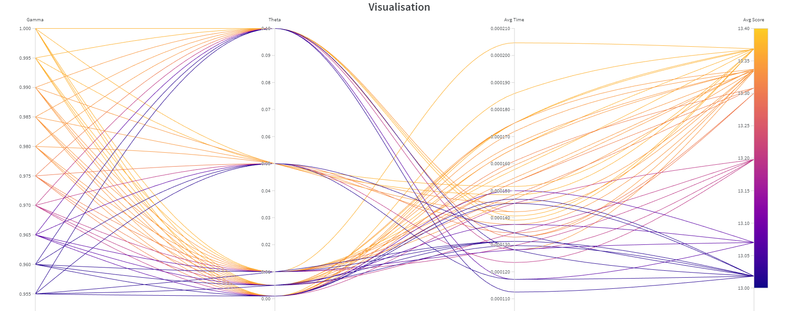

## Introduction
This project was an assignemnt during my Masters course at The University of Bath on October 2022.
Course: MSc Computer Science Module: Artificial Intelligence

The aim of the assignment is to construct an "intelligent" agent (AI) that can choose the best action to take in a dice game. 
The dice game is a single player game that consists of different states (all the possible dice combinations), actions (roll the dice or hold), and rewards (the score of the player). The agent will be using value iteration to determine the best action to take in a given state, a Markov Decision Process (MDP) (Howard, 1960).

In this project we are given two agents to compare with our one, as a measurmenet of how "good" our agent should be. These two agents are:
>1) Always hold: This agent always holds, and never rolls the dice.
>2) Perfectionist : This agent will always roll untill it gets a perfect dice combination. 

All of the agents will be tested under a set of games (100) and the average score will be calculated. The agent with the highest average score will be the best agent. To make the experiment valid, the randomization is eliminated and a "seed" will be used to generate the same random numbers for all the agents.

## Results
>Standard game feedback:
On a fixed set of dice rolls over 1000 games the submitted agent achieved a mean score of 13.416.
(For reference, always holding achieves 10.412, and the optimal strategy achieves 13.424)
This is obviously an extremely strong result, well done.
However, in analytical tests, the agent does not seem to play the true optimal policy.
For example, in state (5, 5, 6) we calculate the optimal action to be (), but your agent plays (0, 2).
If you are using value iteration, it's possible you used a terminating threshold too high, the wrong value of gamma, or there might just be a small mistake.
Extended rules feedback:
Your agent performed just as well or even better on more challenging versions of the game, well done!
Really great work overall. There will be more general feedback on the forums, and if you would like to get more specific individual feedback on part of your submission then you are welcome to contact a tutor.
Keep up the good work.
Final grade is: 91

>Readme feedback:   
Good overview of the value iteration approach and your implementation. Some discussion of your hyperparameter choices, but you could go into more detail.You are correct that a high discount factor is preferable - in fact the best value for gamma is 1.   
Final grade: 91

The project achieved a grade of 91/100

## Background
#
### Markov Decision Process

The Markovs Decision process is a particular type of process that posseses the Markov property, which is that the future is independent of the past given the present. This means that the future state of the system is only dependent on the current state and not on the sequence of events that led to it. This is a very useful property in AI as it allows us to predict the future state of the system. (Puternman, 1990)

This can be represented by the following statment:
> The reward and state at time ***t+1*** are dependent only on the state at time ***t*** and not on the sequence of events that led to it.

Mathematically, the MDP is defined as a tuple (S, A, P, R, γ), where:
>1) S is the set of states (called the state space)
>2) A is the set of actions (in some cases, As is the set of actions available in state s)
>3) P is the transition probability function
>4) R is the reward function
>5) γ is the discount factor

### Value iteration

Given that this game can be modelled using MDP, there exist several methods to solve it. One of these methods is value iteration. (Bellman, 1957) Value iteration is an algorithm that is used to find the optimal policy for a given MDP. It is an iterative algorithm that starts with an initial policy and improves it until it converges to the optimal policy. 

The value of the state is given by the Bellman equation:
> Vk+1(*s*) = max*a* {∑*s+1,r* P(*s+1*, r | *s*, *a*) (r + γVk(*s+1*) )}
  
  Where:
>*s* is the current state\
>*a* is the current action\
>*s+1* is the next state\
>*r* is the reward\
>*k* is the iteration number\
>γ is the discount factor\
>V(*s*) is the value of the state *s*
#
## Implementation

Given any state that the agent is in, there are two decisions that it can make:
>1) Roll the dice
>2) Stick (accept values)

Rolling will transition to a new state, with all states being known to the agent as well as the probabilities assosciated with each state. Rolling has a constant reward assosciated to it. The agent also has the option of choosing which and how many dice to reroll, resulting in 7 different actions in total.
Sticking has no reward nor penalty as it ends the game.

### Old agent
#
This was the original idea with the first research, however several tests had shown that this agent did not have a significant improval on the score of the game over base agents. This agent had undergone optimisation and was still not able to significantly beat the base agents. This agent was removed from the project, however the code is still available under dicegameOLDAGENT.py
In order to run this agent, simply copy the code to the apporpiate box inside the notebook.

The agent will be using the following functions:
>1) \_\_init__ : This function will initialize the agent and set the initial values for the variables.
>2) play : Implemented in the base class, this function will be called to play a game.
>3) calcActionValue : Calculate the expectation value of an action - MDP Implementation
>4) getNextStates : Get the next states and their probabilities.
>5) searchStates: Search for the best action to take in next states, used in iterations
>6) BestAction : Finds the best action to take in a given state (using MDP implementation calcAvtionValue). Updates the global variables to hold the best action and its value.
 

### New agent
#
The new agent will be using the following functions:
>1) \_\_init__ : This function will initialize the agent and set the initial values for the variables.
>2) play : Implemented in the base class, this function will be called to play a game.
>3) getNextStates : Get the next states and their probabilities.
>4) stateValue : Calculates the value of a state using the Bellman equation. (What is used as MDP implementation)
>5) nextActionList : Creates and returns a dictionary of all possible actions and their values.
>6) valueIteration : Creates and returns a dictionary of all possible states and their values. Runs in a loop until the values converge

This agent appears to be slower than the old agent, however it is able to beat the base agents significantly more often. This agent is also able to beat the old agent in most cases. The score of the new agent appears to be higher than that of the old agent as well as the base agents. This agent uses a one-step look ahead and a value iteration algorithm to determine the best action to take in a given state. This agent is able to beat the base agents significantly more often than the old agent. This agent is also able to beat the old agent in most cases (excluding time). 

## Optimisation
#
The weights and biases packages had been used to optimise all agents. The final agent has been optimised using the following parameters:
>1) Gamma values ranging from 0.75 to 0.1
>2) Theta values ranging from 0.1 to 0.0001

The best results appear in a region between 0.995 and 0.1 gamma, and a zoomed in version of the graph is shown below :

From this graph, it can be seen that the best gamma value is 0.1, and the best theta value is 0.1. These values have been used in the final agent. The selection technique aimed to select the lowest time values from the highest average score bundle.

#
## References
#
Howard, R., 1960. Dynamic Programming and Markov Processes. Cambridge: The MIT Press.

Puterman, M., 1990. Chapter 8 Markov decision processes. Handbooks in Operations Research and Management Science, pp.331-434.

Bellman, R., 1957. A Markovian Decision Process. Indiana Univ. Math. J. 6(4), pp.679-684.
